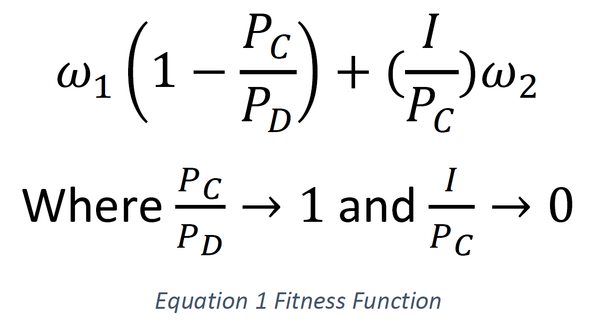

# Applied Artificial Intelligence Project (ACIT4040)
Git repo for the project undertaken in this 3rd semester course of the Applied Computer and Information Technology master degree at OsloMet.
## oslomet-disease-model
> AI-based simulator for optimized mobility in buildings like classrooms in OsloMet areas to reduce risks of Covid-19 spread.

The task at hand is to develop a simulator to visualize and run experiments to assess the effects of the mobility of people at campus and optimize the effects of different measures with an artificial intelligence algorithm.

In order to accomplish this, we aim to experiment with and optimize an agent-based model using an evolutionary algorithm.

Disclaimer: This software was still a work-in-progress at the end of the course, and does not completely fulfill its purpose.
The evolutionary algorithm and the agent-based model are integrated, but a lot of fine-tuning of how the evolvable parameters affect the simulation is still missing.
If you just want to demonstrate how the software works, tune the hyper-parameters low.

This software was developed in Python 3.10. It is considered best practice to create a virtual environment on a per-project-basis, to avoid conflicting versions of packages and libraries. If you're not using an IDE like PyCharm to manage your virtual environments, etc., refer to the Python docs on how to set up your virtual environment.
https://docs.python.org/3/library/venv.html

Install requirements:
```bash
pip install -r requirements.txt
```

The entrypoint script is main.py. You can alter the hyper-parameters inside the set:
```py
hyper_parameters = {
    "number_of_generations":            2,
    "genome_length":                    6,
    "mutation_probability":             0.2,
    "do_crossover":                     True,
    "soft_mutation":                    True,
    "population_size":                  4,
    "surviving_individuals":            2,
    "number_of_parents":                2,
    "desired_agent_population":         500,
    "desired_agent_population_weight":  1,
    "relative_spread_weight":           1
}
```

The first time you run the evolution, the map will be imported and the agent paths will be calculated and saved as files in the project root.

Statistical outputs will be found in the output folder after completing the final evolution.




    
https://www.geogebra.org/3d/zqvfvabd
